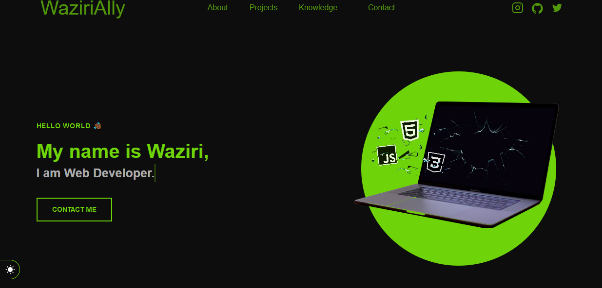

<h1 align="center">Portifolio - Waziri 💻</h1>

<h4 align="center"><a href="#">Check the project here</a></h4>

---

## 👨🏿‍💻 About

Project made in order to introduce myself as a full stack  web developer.

## 🤯 The website consists of:

- **Home:** My presentation;
- **About me:** I talk a little about my trajectory and my current state;
- **Projects:** Some recent projects I've done;
- **knowledge:**The technologies I am aware of;
- **Talk to me:**Area with means of contacting me;
- **Social Media:** My social networks available in the navigation menu and in the footer of the site.

## 🧠 Technologies used:

O site **still in development**,because I'm constantly learning. But so far I have used the technologies:

    
    
    

 

---

<table>
  <tr>
    <td>
      Made by <a href="https://github.com/WAZIRI123">Waziri Ally.</a> 🙋🏿‍♂️
    </td>
  </tr>
</table>
